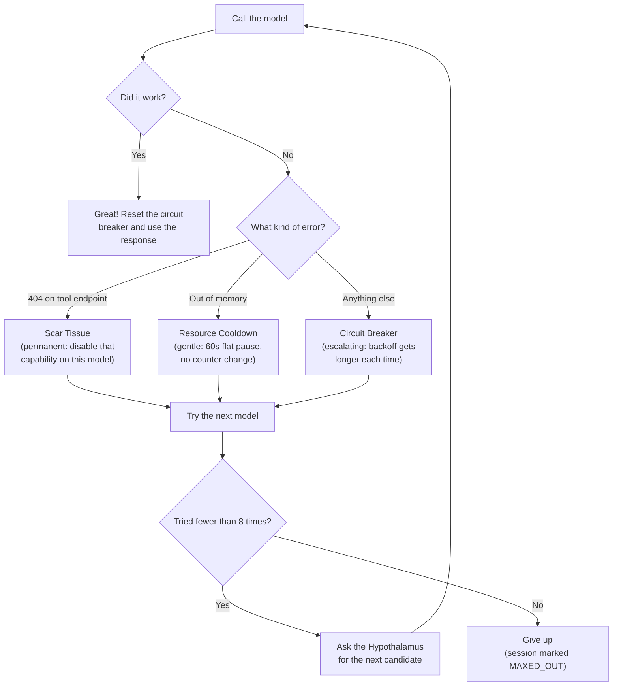

# Hypothalamus — Model Selection

Your real hypothalamus is amazing. It sits deep in your brain and it knows what's available to you — food, water, warmth, rest — and it picks what you need right now based on how you're doing. Hungry? It nudges you toward the kitchen. Overheating? It makes you sweat. It doesn't *do* the eating or the sweating — other parts of the body handle that — but it's the one that knows what's out there and decides what to reach for.

Are-Self's Hypothalamus works the same way, except instead of food and water, it knows about AI models. Hundreds of them — big ones, small ones, fast ones, expensive ones, local ones running on your machine, remote ones running in the cloud. When the [Frontal Lobe](./frontal-lobe) needs to think (which is its whole job), it doesn't pick its own brain. It asks the Hypothalamus: "given who I am, what I need to do, and what's healthy right now, which model should I use?"

The Hypothalamus looks at three things to answer that question: how well the model *fits* the identity asking (semantic matching), whether the model is *healthy* right now (circuit breaker status), and whether the identity can *afford* it (budget). Then it hands back a recommendation and the [Frontal Lobe](./frontal-lobe) goes to work.

If that model fails mid-conversation — the server's down, or the machine ran out of memory, or something else went wrong — the system doesn't just crash. The [Frontal Lobe](./frontal-lobe) comes back and says "that didn't work, give me another one." The Hypothalamus walks down a failover chain and picks the next best option. This can happen up to 8 times before anyone gives up.

## How Model Selection Actually Works

When the [Frontal Lobe](./frontal-lobe) asks for a model, the selection happens in three phases.

### Filtering — Who's Even Eligible?

First, the Hypothalamus builds a pool of candidates by checking every model provider against a set of gates. Think of it like a bouncer at the door — you have to pass every check to get in:

**Is it turned on?** If someone manually disabled a provider, it's invisible. Simple as that.

**Is it healthy?** This is the circuit breaker check. If a model failed recently and it's still on cooldown, it gets filtered out completely. More on how that works [below](#when-things-go-wrong--circuit-breakers).

**Can the identity afford it?** If the [IdentityDisc](./identity) has a budget set up, the model's cost per token has to be at or below the ceiling. An identity with a small budget won't even see the expensive cloud models.

**Can it do what's needed?** If the [Frontal Lobe](./frontal-lobe) is sending tools for the model to call, only providers with function-calling capability make the cut. If a model previously proved it *can't* do tool use (scar tissue — more on that later), it's treated as not having that capability.

**Is the provider allowed?** Identities can have a ban list. "This identity never uses OpenAI" or "keep this one local only." Any banned provider is excluded.

Whatever survives all those checks is the candidate pool.

### Strategy — What's the Game Plan?

Now the Hypothalamus needs to pick *one* from the pool. The `attempt` number tells it where to look:

**First try (attempt 0)** — If the identity has a preferred model, and it's in the pool, just use it. No math, no comparison. It's the first choice.

**Second try and beyond** — This is where the failover strategy kicks in. Every identity can have a `FailoverStrategy`, which is just an ordered list of steps to try. Each step is a different approach:

- **Family failover**: Stay in the same model family. If the preferred model was a Qwen, try other Qwen variants. Keeps the "personality" similar.
- **Local failover**: Try a specific backup model that's been configured as the local safety net.
- **Vector search**: Open it up to the whole candidate pool and find the best semantic match (see next section).
- **Strict failover**: Stop trying. No more attempts. Used when you'd rather fail than use the wrong model.

If no strategy is configured at all, the system just does a vector search across everything available.

### Vector Matching — Finding the Best Fit

This is the clever part. Every [IdentityDisc](./identity) and every AI model in the catalog has a 768-dimensional embedding vector — basically a mathematical fingerprint of what it's about. The identity's vector captures its personality, its tags, what kinds of tasks it does, its system prompt. The model's vector captures its name, creator, family, size, what it's good at, what it was trained for.

The Hypothalamus compares these fingerprints using cosine distance. The closer the match, the better the fit. Among equally good matches, it picks the cheapest one.

If an identity hasn't been embedded yet (no vector), the system falls back to just picking the cheapest available model. It works, but it's not smart. Embedding your identities makes selection way better.

## When Things Go Wrong — Circuit Breakers

In real life, if you eat something and it makes you sick, your body remembers. You avoid that food for a while. If it makes you sick *again*, you avoid it for even longer. Eventually you might try it one more time, and if it's fine, you move on. But if it keeps making you sick, the avoidance period keeps growing.

That's exactly how Are-Self's circuit breaker works.

When the Synapse Client (the wire between the [Frontal Lobe](./frontal-lobe) and the model provider) tries to call a model and it fails — timeout, server error, rate limit, whatever — it "trips" the circuit breaker on that provider. The provider goes on a timeout. While it's on timeout, the Hypothalamus won't even consider it as a candidate.

### How the Timeout Escalates

The first time a provider fails, it gets a 60-second cooldown. If it fails again right after coming back, the cooldown doubles. And doubles again. This is called exponential backoff:

| Consecutive failures | Cooldown |
|---------------------|----------|
| 1st | 60 seconds |
| 2nd | 2 minutes |
| 3rd | 4 minutes |
| 4th and beyond | 5 minutes (that's the cap) |

The cooldown never goes higher than 5 minutes. The system is patient, but not *that* patient.

### Getting Better

Here's the nice part: one success wipes the slate clean. The moment a provider handles a call successfully, its failure counter resets to zero. Fully rehabilitated. No grudges.

There's also a manual reset button in the UI and API (`POST /api/v2/model-providers/{id}/reset_circuit_breaker/`) for when you *know* you fixed the problem — you restarted Ollama, plugged the API key back in, whatever — and you don't want to wait out the clock.

### The Lifetime Counter

Even though the failure counter resets on success, there's a separate `total_failures` count that never resets. It's purely for visibility — you can look at a provider and see "this thing has failed 47 times total" and decide if it's worth keeping around. Nobody acts on it automatically; it's just there so you know.

## Resource Cooldown — When It's Not the Model's Fault

Sometimes the model is perfectly fine but your *machine* is the problem. You have too many browser tabs open, another model is hogging the GPU, and Ollama comes back with something like "model requires more system memory (22.5 GiB) than is available (18.7 GiB)."

That's not the model's fault. It's not broken. You just need to free up some memory.

If the system treated this like a regular failure, the circuit breaker would start escalating — 60 seconds, then 2 minutes, then 4 — and by the time you close your browser tabs, the model is benched for 5 minutes even though it's ready to go. That's not fair to the model, and it's annoying for you.

So the system handles resource errors differently. Instead of tripping the circuit breaker, it applies a **resource cooldown**: a flat 60-second pause, every time, no escalation. The failure counter doesn't increment. The backoff doesn't grow. It just waits a minute, tries again, and if memory is still tight, waits another minute.

Here's how they compare side by side:

| | Circuit Breaker | Resource Cooldown |
|---|---|---|
| **When** | Provider is returning errors | Machine is out of memory |
| **Cooldown** | Escalates: 60s, 2m, 4m, 5m cap | Always 60 seconds |
| **Failure counter** | Goes up every time | Never touched |
| **Effect on future timeouts** | Each failure makes the next one longer | None |
| **Who's at fault** | The provider | Your machine |

The Synapse Client figures out which one to use by looking at the error message. If it sees phrases like "requires more system memory", "out of memory", or "insufficient memory", it knows this is a resource problem and uses the gentle path.

## Scar Tissue — When a Model Proves It Can't Do Something

There's one more kind of error that gets special treatment. Sometimes a model says it supports tool calling, but when you actually try to use it, the endpoint returns a 404 — it just doesn't exist. The model is fine for regular chat, but it *cannot* do function calling.

When this happens, the system permanently marks that capability as disabled on that provider. It's called scar tissue, and it doesn't heal. The model won't be offered for tool-calling tasks again, but it's still available for everything else.

This is different from the circuit breaker (which is temporary and heals on success) and different from the resource cooldown (which is about the machine, not the model). Scar tissue is about the model honestly not being able to do something it claimed it could.

## The Error Flow — All Three Together

When the Synapse Client calls a model and it fails, it classifies the error and picks the right response:

All three paths end the same way: the [Frontal Lobe](./frontal-lobe) asks the Hypothalamus for another candidate. The Hypothalamus doesn't know or care *why* the last one failed — it just sees "attempt 2" and walks to the next step in the failover strategy.

## Budgets

The Hypothalamus also handles money. Every [IdentityDisc](./identity) can have a budget — a ceiling on how much it's allowed to spend per period (daily, monthly, per-request, whatever). The budget tracks both token counts and actual cost.

This is still being built out and isn't the easiest thing to configure yet, but the idea is powerful: someone with deep pockets can route through the most expensive, highest-quality models in the world. Someone running on a budget gets routed to the best free or cheap model that fits. The Hypothalamus enforces this at selection time — expensive models simply don't appear in the candidate pool for budget-constrained identities.

Budget tracking is precise down to individual tokens. Cost is calculated from the model provider's pricing metadata. Warnings can fire at configurable thresholds (like 80% spent), and when the budget is exhausted, the identity can be hard-stopped, soft-stopped, queued, or flagged for manual review.

## The Model Catalog

The Hypothalamus keeps a catalog of every available model, synced from two sources:

**Ollama** — Local models running on your machine. Sync pulls in whatever you've installed via `ollama pull`. These are free to run (you're paying in GPU time and electricity, not API calls).

**OpenRouter** — Cloud models from many providers (OpenAI, Anthropic, Google, Mistral, etc.). These have per-token pricing that gets imported during catalog sync.

Each model in the catalog carries rich metadata: its family (Llama, Gemma, Qwen, Mistral...), its creator, parameter count, context length, capabilities, benchmark scores, and a 768-dim embedding vector that captures what the model is "about" semantically.

The catalog is browseable and searchable through the [Hypothalamus UI](../ui/hypothalamus).

## API Endpoints

### AI Models & Catalog

| Method | Endpoint | Purpose |
|--------|----------|---------|
| `GET` | `/api/v2/ai-models/` | List available models |
| `POST` | `/api/v2/ai-models/` | Create model |
| `PATCH` | `/api/v2/ai-models/{id}/` | Update model |
| `DELETE` | `/api/v2/ai-models/{id}/` | Delete model |
| `GET` | `/api/v2/model-categories/` | List model categories (e.g., "reasoning") |
| `POST` | `/api/v2/model-categories/` | Create category |
| `GET` | `/api/v2/model-families/` | List model families (Llama, Gemma, etc.) |
| `POST` | `/api/v2/model-families/` | Create family |

### Providers & Routing

| Method | Endpoint | Purpose |
|--------|----------|---------|
| `GET` | `/api/v2/llm-providers/` | List LLM provider configurations |
| `POST` | `/api/v2/llm-providers/` | Create provider |
| `PATCH` | `/api/v2/llm-providers/{id}/` | Update provider |
| `DELETE` | `/api/v2/llm-providers/{id}/` | Delete provider |
| `GET` | `/api/v2/model-providers/` | List model-to-provider associations |
| `POST` | `/api/v2/model-providers/` | Create association |

### Pricing & Budget

| Method | Endpoint | Purpose |
|--------|----------|---------|
| `GET` | `/api/v2/model-pricing/` | List pricing configurations |
| `POST` | `/api/v2/model-pricing/` | Create pricing tier |
| `PATCH` | `/api/v2/model-pricing/{id}/` | Update pricing |
| `GET` | `/api/v2/budget-periods/` | List budget period types (daily, monthly) |
| `POST` | `/api/v2/budget-periods/` | Create period |

### Circuit Breakers & Failover

| Method | Endpoint | Purpose |
|--------|----------|---------|
| `POST` | `/api/v2/model-providers/{id}/reset_circuit_breaker/` | Manually reset a provider's circuit breaker |
| `POST` | `/api/v2/model-providers/{id}/toggle_enabled/` | Enable or disable a provider |
| `GET` | `/api/v2/failover-strategies/` | List failover strategies |
| `POST` | `/api/v2/failover-strategies/` | Create failover strategy |
| `PATCH` | `/api/v2/failover-strategies/{id}/` | Update strategy |
| `GET` | `/api/v2/failover-types/` | List failover types |
| `POST` | `/api/v2/failover-types/` | Create type |

### Selection & Matching

| Method | Endpoint | Purpose |
|--------|----------|---------|
| `GET` | `/api/v2/selection-filters/` | List model selection filters |
| `POST` | `/api/v2/selection-filters/` | Create filter |
| `PATCH` | `/api/v2/selection-filters/{id}/` | Update filter |

### Usage Tracking

| Method | Endpoint | Purpose |
|--------|----------|---------|
| `GET` | `/api/v2/usage-records/` | List usage records |
| `POST` | `/api/v2/usage-records/` | Create usage record |
| `GET` | `/api/v2/sync-status/` | Sync status (Ollama/OpenRouter sync) |
| `GET` | `/api/v2/sync-logs/` | Sync operation logs |

## How It Connects

- **[Frontal Lobe](./frontal-lobe)**: Asks the Hypothalamus for a model before each reasoning turn. Comes back with an incremented attempt number when the previous pick fails. Up to 8 attempts per turn.
- **Synapse Client**: The [Frontal Lobe](./frontal-lobe)'s wire to the model provider. Classifies errors into scar tissue, resource cooldown, or circuit breaker. Reports failure back for failover.
- **[Identity](./identity)**: The [IdentityDisc](./identity)'s 768-dim vector drives semantic matching. Budget constraints and banned provider lists are all per-identity.
- **[Central Nervous System](./central-nervous-system)**: Model selection happens inside spike execution. Failures trigger Cortisol signals through the [Synaptic Cleft](./synaptic-cleft).
- **[Parietal Lobe](./parietal-lobe)**: Tool execution cost is tracked as usage against the identity's budget.
- **[Synaptic Cleft](./synaptic-cleft)**: Fires Cortisol signals when circuit breakers trigger, keeping the frontend informed in real time.
